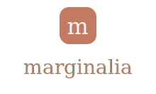

<p align="center">
  
</p>

<h1 align="center">marginalia</h1>

<p align="center">
  <em>Turn the notebooks you write by hand on your Kindle Scribe into Markdown you can actually use in Obsidian.</em>
</p>

<p align="center">
  <a href="https://github.com/VforVitorio/marginalia/actions/workflows/ci.yml"></a>
  <a href="LICENSE"></a>
  
  
  <a href="https://marginalia.is-a.dev/"></a>
</p>

<p align="center">
  <b><a href="https://marginalia.is-a.dev/">Website</a></b> ·
  <a href="docs/ARCHITECTURE.md">Architecture</a> ·
  <a href="docs/demo/marginalia-demo.mp4">Demo video</a>
</p>

You write by hand on the Scribe, export the notebook as a PDF, and marginalia does the boring part: it runs OCR over your handwriting, lets you fix whatever the OCR got wrong, and drops the result into your vault — keeping the folder structure you already use on the device.

The name comes from *marginalia*, the notes people used to scribble in the margins of manuscripts. Same idea: getting handwritten thought to survive the jump to digital.

<p align="center">
  
</p>
<p align="center">
  <em>Import a Scribe PDF → OCR the handwriting (even math, as KaTeX) → review side-by-side → export to your Obsidian vault. <a href="docs/demo/marginalia-demo.mp4">full-quality video</a></em>
</p>

## What it does

- **Local OCR** with Qwen3-VL (2B or 4B) through Ollama or LM Studio. Runs on an 8 GB GPU, nothing leaves your machine.
- **Cloud OCR** when you want it — Claude (through your subscription, no API key) or Gemini (free tier), with a model picker. Good for the pages the local model chokes on.
- **A review screen**: your original page on one side, the transcription on the other. Edits auto-save as you type; fix the mistakes before anything touches your vault.
- **Folder structure carries over**. Your Scribe folders become folders and `[[wikilinks]]` in Obsidian — your call. Handwritten math renders as KaTeX.
- **Everything's a button.** Switching models, pulling a new one, local vs cloud, exporting — no terminal once it's running.

## Kindle Scribe only (for now)

This is built for the Kindle Scribe and nothing else. No reMarkable, no Apple Notes, no Samsung Notes. If you use another device, marginalia won't help you yet — and there are tools that already do this well for those (Scrybble for reMarkable, for instance).

It's not laziness about portability: export quirks differ enough between devices that "support everything" usually ends up as "support nothing well." Scribe first.

## Stack

| Layer | Tech |
|---|---|
| Backend | Python 3.12+ · uv · FastAPI · Pydantic v2 · PyMuPDF |
| OCR | Qwen3-VL via Ollama / LM Studio (local) · Claude Agent SDK · Gemini (cloud) |
| Frontend | Vite · React · TypeScript · Tailwind · GSAP |
| Streaming | Server-Sent Events (decoupled background runner) |
| Export | Jinja2 · Markdown with frontmatter, wikilinks, KaTeX |
| Quality | Ruff · mypy · pytest · vitest · CI on every PR |

## Getting started

### Install (one command — no Node required)

```bash
# macOS / Linux
curl -fsSL https://raw.githubusercontent.com/VforVitorio/marginalia/main/scripts/install.sh | bash

# Windows (PowerShell)
irm https://raw.githubusercontent.com/VforVitorio/marginalia/main/scripts/install.ps1 | iex
```

The installer sets up `uv` (which brings its own Python), clones marginalia, downloads the prebuilt frontend from the latest release, and launches the app on http://localhost:8000. You only need **git + a shell**. For **local OCR** also install Ollama or LM Studio; for **cloud OCR** use a Claude or Gemini account. Relaunch any time with `uv run marginalia` (from the install folder, default `~/marginalia`). The vault path and almost everything else is set from the UI — `providers.toml` is just the starting point and where API keys live.

### From source (development — needs Node 20+)

```bash
git clone https://github.com/VforVitorio/marginalia.git
cd marginalia
cp providers.example.toml providers.toml
scripts/run.sh        # macOS/Linux (Windows: scripts\run.ps1) — builds the UI from source, then runs
```

For frontend work, run the API and the Vite dev server separately: `npm run dev` in `frontend/` serves the UI on `:5173` and proxies `/api` to the backend.

## How it works

1. **Export from the Scribe**: Notebooks → hold the cover → Export/Share → PDF. Save it to your synced folder or drop it straight into the app.
2. **Import**: drag the PDF in, or point marginalia at your synced folder and pick from what's there.
3. **Pick a backend**: local for privacy, cloud for the hard pages. One click.
4. **Review**: page by page, fix what the OCR misread. A normal notebook takes a couple of minutes. OCR keeps running in the background even if you close the tab — reopen and it picks up where it was.
5. **Export**: choose how it lands in Obsidian (mirror folders, wikilinks), hit export.

## Customizing the OCR system prompt

Transcription quality depends on two things: the **model you pick** and the **instructions it gets**. The OCR runs with a system prompt tuned for Obsidian — LaTeX math (`$…$` inline, `$$…$$` blocks), callouts, checkboxes, tables, headings: the rich Markdown Obsidian actually renders. If you want to steer it (your own conventions, a different structure), it lives in one place:

- `backend/marginalia/ocr/prompts.py` → `system_prompt()` — the full instructions.
- `backend/marginalia/ocr/prompts.py` → `handwriting_prompt()` — the short per-page instruction.

Edit, restart the backend, done.

## Status

**Complete and hardened.** The whole flow — import → OCR (local or cloud) → side-by-side review → export to Obsidian — works end-to-end (that's the demo above), with a one-command install and a live [website](https://marginalia.is-a.dev/).

Past the MVP, it's been through a full code-audit remediation: data-safe autosave, OCR that runs in a decoupled background task (survives disconnects, multiple tabs tail one run, resumes from disk), honest provider/model status, atomic writes, and a backend + frontend test suite that runs in CI on every PR. Architecture and conventions live in [docs/ARCHITECTURE.md](docs/ARCHITECTURE.md) and [CLAUDE.md](CLAUDE.md).

## Roadmap (later, maybe)

- Process multiple notebooks at once (the runner is already decoupled to allow it)
- Pull in Kindle highlights (`My Clippings.txt`)
- Custom export templates
- Full-text search across exports
- Scheduled pull from Drive
- Other devices — someday, not soon

## FAQ

**Why not just use the Scribe's built-in "Convert to text"?** Amazon's conversion emails you a flat `.txt`. marginalia drops the result straight into Obsidian — your Scribe folder structure mirrored, optional wikilinks, real Markdown (headings, tables, callouts, KaTeX math) — and lets you fix the OCR before it ever touches your vault. It can also run fully local, so nothing leaves your machine.

**Does it work with reMarkable, iPad, etc.?** Not yet. This is for the Kindle Scribe. If you use another device, there are better tools for it (Scrybble for reMarkable, Apple Importer for Apple Notes).

**Do I need an API key?** For local OCR (Ollama), no. For cloud, you either use your Claude subscription (no API key) or a free Gemini key from AI Studio.

**Does it run on Mac/Windows/Linux?** Yes — pure-Python backend, web frontend. Runs on Windows, macOS, and Linux.

**What if the OCR is bad?** That's what the review is for: you see the original image and the text, and you edit it before exporting. If it's still bad, run that page through a cloud backend (Claude or Gemini) — they hold up better on messy handwriting.

## Contributing

PRs welcome, Scribe-only. Issues about other devices will be closed — not out of spite, just scope. Fork, branch, follow the conventions in [CLAUDE.md](CLAUDE.md), open a PR. CI (`test` / `lint` / `typecheck` / `frontend-build`) must be green.

## Trademarks

Kindle and Kindle Scribe are trademarks of Amazon. Obsidian is a trademark of Obsidian Foundry. marginalia is not affiliated with, endorsed by, or sponsored by either — the names are here so you know what works with what.

## License

MIT. Use it, fork it, sell it, whatever — just keep the notice. No warranty. See [LICENSE](LICENSE).
